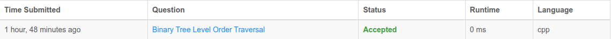
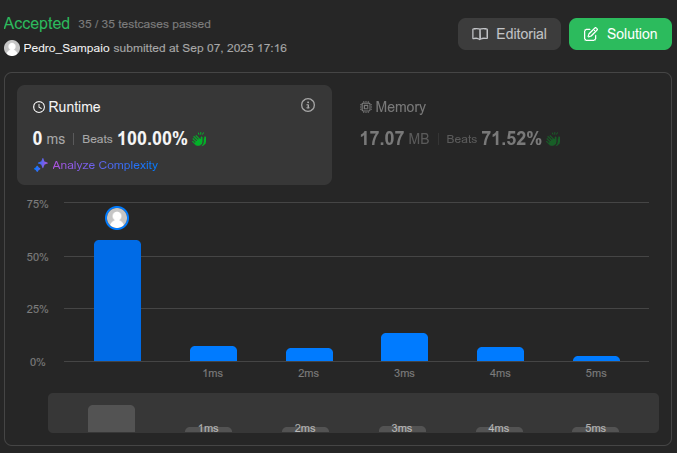

# Exercícios de Grafos 1

**Número da Lista**: 1  
**Conteúdo da Disciplina**: FGA0124 - PROJETO DE ALGORITMOS

## Aluno

<table>
  <tr>
    <td align="center"><a href="https://github.com/PedroSampaioDias"> <b>Pedro Sampaio</b></a> </td>
  </tr>
</table>

| Matrícula   | Aluno                             |
| ----------- | ---------------------------------- |
| 211043745   | Pedro Sampaio Dias Rocha           |

## Sobre 
A atividade foi baseada na resolução de desafios de programação da plataforma LeetCode. Para compor a entrega, foram selecionados três exercícios de diferentes níveis de dificuldade: dois avançados e um intermediário.

## Exercícios 

### [102. Binary Tree Level Order Traversal](https://leetcode.com/problems/binary-tree-level-order-traversal/) - Medium

  

  

## Apresentação 

Autor: [Pedro Sampaio](https://github.com/PedroSampaioDias)

