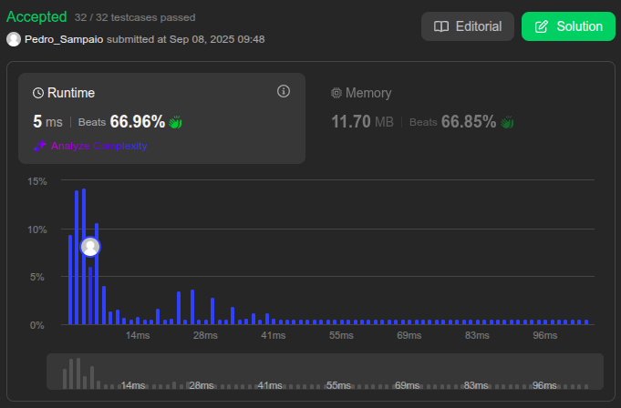

# Exercícios de Grafos 1

**Número da Lista**: 1  
**Conteúdo da Disciplina**: FGA0124 - PROJETO DE ALGORITMOS  

## Aluno

<table>
  <tr>
    <td align="center"><a href="https://github.com/PedroSampaioDias"> <b>Pedro Sampaio</b></a> </td>
  </tr>
</table>

| Matrícula   | Aluno                             |
| ----------- | --------------------------------- |
| 211043745   | Pedro Sampaio Dias Rocha          |

## Sobre 
A atividade foi baseada na resolução de desafios de programação da plataforma LeetCode. Para compor a entrega, foram selecionados três exercícios de diferentes níveis de dificuldade: dois avançados e um intermediário.

## Exercícios 

### [102. Binary Tree Level Order Traversal](https://leetcode.com/problems/binary-tree-level-order-traversal/) - Medium  

Dado o nó raiz de uma árvore binária, retorne os valores dos nós em ordem de níveis (da esquerda para a direita, nível por nível).  

**Exemplo**  

Entrada:  
`root = [3,9,20,null,null,15,7]`  
Saída:  
`[[3],[9,20],[15,7]]`  

**Ideia**  

Usar BFS com uma fila:  

- Enfileirar a raiz.  
- Processar os nós de cada nível, guardando seus valores.  
- Enfileirar os filhos para o próximo nível.  

**Prints**

  

  

---

### [127. Word Ladder](https://leetcode.com/problems/word-ladder/) - Hard  

Dado `beginWord`, `endWord` e uma lista de palavras, encontre o **menor número de transformações** para converter `beginWord` em `endWord`, alterando **uma letra por vez** e garantindo que **cada palavra intermediária** exista na lista.

**Exemplo**  

Entrada:  
beginWord = "hit", endWord = "cog",  
wordList = ["hot","dot","dog","lot","log","cog"]  
Saída:  
5  
Explicação: "hit" → "hot" → "dot" → "dog" → "cog" (5 palavras)

**Ideia**  

Usar **BFS com fila** e um conjunto para o dicionário:  

- Enfileirar `beginWord` e processar por níveis (cada nível = 1 transformação).  
- Para cada palavra do nível, gerar todas as vizinhas trocando uma letra de 'a' a 'z'.  
- Se a vizinha estiver no dicionário, enfileirar e removê-la do dicionário (evita revisitas).  
- Quando `endWord` for alcançada, retornar o nível atual (número de passos).  

**Prints**

  

  

---

### [773. Sliding Puzzle](https://leetcode.com/problems/sliding-puzzle/) - Hard  

Dado um tabuleiro 2x3 contendo os números `0..5`, onde `0` representa o espaço vazio, mova o `0` trocando com um número adjacente até alcançar o estado alvo `"123450"`. Retorne o **menor número de movimentos** necessários. Se for impossível, retorne `-1`.

**Exemplo**  

Entrada:  
board = [[1,2,3],[4,0,5]]  
Saída:  
1  
Explicação: mover o `0` trocando com `5` resulta em `[[1,2,3],[4,5,0]]`, que é `"123450"`.

**Ideia**  

Usar **BFS** sobre estados:  

- Representar o tabuleiro como **string** (ex.: `"123405"`).  
- Enfileirar o estado inicial e visitar por níveis.  
- Em cada passo, localizar a posição do `'0'` e gerar estados vizinhos trocando com posições permitidas.  
- Quando o estado alvo `"123450"` for encontrado, retornar a quantidade de passos.

**Prints**

  

  

## Apresentação 

Autor: [Pedro Sampaio](https://github.com/PedroSampaioDias)

